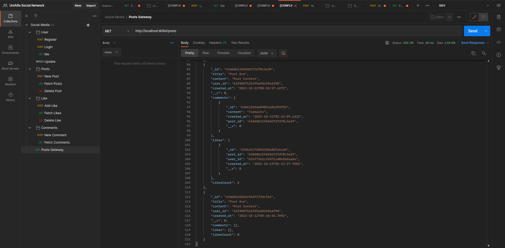

## API



## Análise

https://excalidraw.com/#json=ar9YJV2KPwOB1hit2MnEp,hqHgz-orKOUz1dmUiAK9EA

## Preencha aqui as seguintes informações no seu fork

**Lucas Giori Cesconetto | Jeyson Luiz Romualdo**:

**lucasgioricesconetto@gmail.com | jeysonlr@gmail.com**:

**Url da documentação: https://documenter.getpostman.com/view/5059639/2s83zjtPXP**:

### Descreva abaixo como iniciar seu projeto


## Endpoints

## Users

- POST - {HOST-SERVICE}/users/register
```json
{
    "name": "Lucas Giori Cesconetto",
    "email":"teste@gmail.com",
    "password": "12345678"
}
```
- POST - {HOST-SERVICE}/users/login 
```json
{
    "email": "teste@gmail.com",
    "password": "123456789"
}
```

- GET - {HOST-SERVICE}/users/me
```
--header Authorization: {token}
```

## Posts

- POST - {HOST-SERVICE}/posts 
```json
{
    "title":"Post One",
    "content": "Post Content",
    "user_id": "632773e1cf3471c48bfad6cc"
}
```

- GET - {HOST-SERVICE}/posts
- GET - {HOST-SERVICE}/posts?user=&sort=DESC&page=1&limit=10
- GET - {HOST-SERVICE}/posts?user=632773e1cf3471c48bfad6cc&sort=ASC&page=1&limit=10


# Projeto final da disciplina de NodeJS da UniALFA

Os diretores da UniAlfa ficaram muito animados com o crescimento da universidade e decidiram criar a UniAlfa Social, a rede social da universidade. Esta rede social consiste em basicamente uma área onde é possível cadastrar e remover postagens, curtir e comentar postagens. Para realizar estas ações o usuário precisa estar logado no sistema.


## O que esperamos ter nesta API?

- Cadastro de usuário
- Login
- Detalhes do usuário atual
- Alterar senha
- Adicionar e remover uma post
- Adicionar e remover um comentário em um post
- Adicionar e remover uma curtida em um post
- Listar posts mais recentes
- Listar posts criados pelo usuário atual com quantidade de curtidas e comentários
- Listar comentários e curtidas de um post

## Pré-requisitos

- Ser desenvolvido em NodeJs
- Utilizar um Backend Framework (Preferência o Express)
- Banco de Dados NoSQL (Preferência o MongoDB)
- Autenticação e autorização com JWT
- Testes integrados
- Typescript
- Documentação publicada no postman